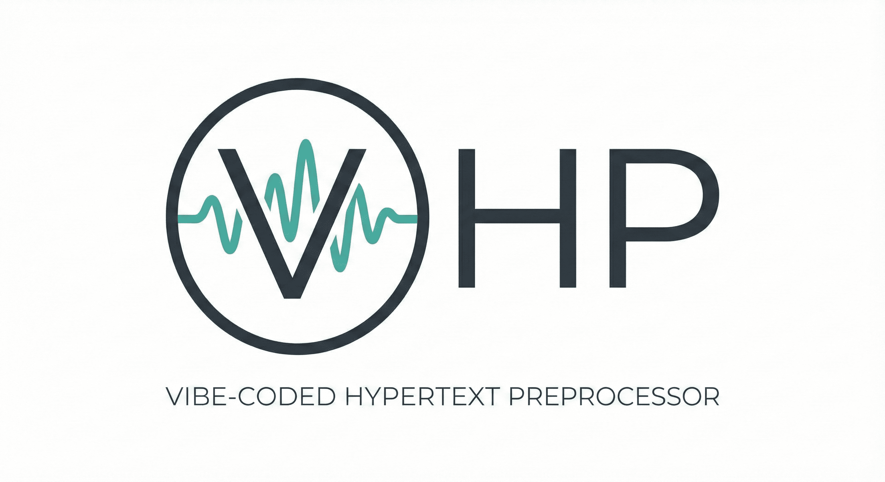

#  VHP

### Vibe-coded Hypertext Preprocessor

_A PHP superset built entirely in Rust through AI-assisted development_

<div class="hero-links">
  <a href="features">Features</a>
  <a href="installation">Installation</a>
  <a href="usage">Usage</a>
  <a href="examples">Examples</a>
  <a href="roadmap">Roadmap</a>
  <a href="architecture">Architecture</a>
</div>

---

## What is VHP?

**VHP** is a modern PHP implementation written from scratch in Rust. The name stands for "**V**ibe-coded **H**ypertext **P**reprocessor" — reflecting that it's being built entirely through prompts to AI agents ("vibe coding").

### Goals

- **Fast** — Native performance via Rust compilation
- **Secure** — Memory safety guaranteed by Rust's ownership model
- **Zero Dependencies** — Built using only Rust's standard library
- **PHP 8.x Compatible** — Run existing PHP code with zero modifications
- **Progressive** — New features added incrementally with comprehensive tests

## Quick Start

```bash
# Clone and build
git clone https://github.com/leocavalcante/vhp.git
cd vhp
cargo build --release

# Run a PHP file
./target/release/vhp script.php

# Run inline code
./target/release/vhp -r 'echo "Hello, VHP!";'
```

## Why "Vibe Coding"?

VHP is an experiment in AI-assisted software development. Every line of code has been written through conversations with AI agents (Claude). The goal is to demonstrate that complex systems like programming language interpreters can be built entirely through natural language prompts.

---

<p align="center">
  Built with Rust and AI
</p>
